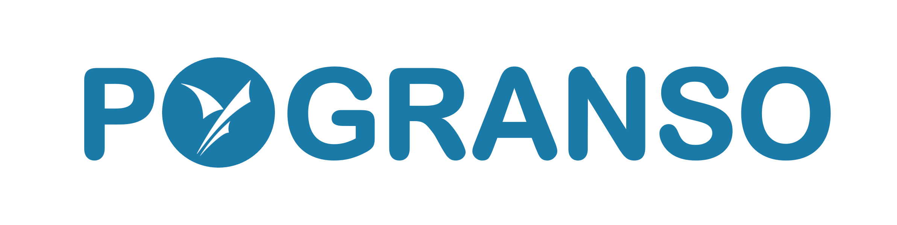

# PyGRANSO

PyGRANSO: a Python numerical package using GRadient-based Algorithm for Non-Smooth Optimization

Toward a user-friendly and scalable numerical package for nonsmooth, nonconvex, constrained optimization

Please check https://pygranso.readthedocs.io/en/latest for detailed documentation.

## Motivation and Background

Mathematical optimization is an indispensable modeling and computational tool for all science and 
engineering fields. Over the past decades, researchers have developed numerous foolproof techniques 
and user-friendly software packages to solve convex optimization problems—a subset of optimization 
problems with benign global structures (Boyd et al., 2004; Grant et al., 2008). These software 
packages have substantially lowered the barrier for non-expert practitioners to access and deploy 
these advanced techniques. However, practical problems are often nonconvex, nonsmooth, and constrained, 
and hence unamenable to convex optimization techniques. A notable family of examples is deep learning 
problems—which underpins the ongoing revolutions in AI and countless scientific and applied fields. 
Reliably solving such problems often entails substantial optimization expertise  (Bagirov et al., 2014), 
and practical problems are becoming increasingly more complex and large-scale that outpace what the existing 
software packages can handle. 

The GRANSO package (http://www.timmitchell.com/software/GRANSO/) is the first numerical optimization package that can handle general nonconvex, 
nonsmooth, constrained optimization problems based on MATLAB  (Curtis et al., 2017). The package is very stable and 
produces meaningful results when other carefully crafted solvers fail. However, several 
limitations of GRANSO preclude its potential broad deployment by general users:  

1. It only allows vector variables but not matrices or tensors, while the latter two are common 
computational units in modern optimization problems such as machine/deep learning.   

2. The default MATLAB quadratic programming solver struggles to scale up to medium- to large-scale 
problems, which is a bottleneck for scalability. 

3. GRANSO requires deriving analytic subgradients for the objective and constraint functions, which 
is challenging and even infeasible, especially in deep learning.  

4. MATLAB that GRANSO is written in is a proprietary programming language and entails considerable 
license fees for researchers and developers. 

## Our Contributions

By revamping several key components of GRANSO, we built a scalable and user-friendly python numerical optimization 
packages called PyGRANSO for solving general nonconvex, nonsmooth, constrained optimization problems. 

Main improvements includes:

1. Revamping GRANSO and translating it into Python (PyGRANSO) for following advantages:
   
   1) Autodifferentiation. Pytorch provide first-rate autodifferentiation capabilities, 
      removing the pain of deriving analytic subgradients. Powerful matrix/tensor 
      computation and autodifferentiation will substantially boost the usability and 
      scalability of GRANSO for non-experts, and turn the impossible, e.g., constrained deep 
      learning, into possible.

   2) GPU support. Pytorch is a modern Python computational frameworks, which enables highly optimized 
      and parallelizable matrix/tensor computations that take the full advantage of modern massively 
      parallel hardware, e.g., GPUs.

2. Allowing matrix and tensor optimization variables in PyGRANSO.

3. Replacing the current MATLAB builtin quadratic solver with the osqp package (https://osqp.org/docs/index.html). 
   The osqp package is a great alternative to MATLAB’s slow quadratic solver, 
   and has consistently and significantly outperformed popular commercial solvers 
   in terms of speed and scalability. 

4. Enabling PyGRANSO to solve small scale unconstrained deep learning problems. The new version that could 
   handle constrained deep learning problem will be released soon.  

5. Added several new user options to solve common numerical issues in deep learning: linesearch_maxit, linesearch_step_size, 
   is_backtrack_linesearch, searching_direction_rescaling, disable_terminationcode_6. Check the settings page for more information.

## Current Limitations

1. L-BFGS methods didn't implemented yet. The standard BFGS is memory consuming and weakens the ability of PyGRANSO to explore large-scale deep learning problem.

2. Constrained deep learning problem cannot be handdled by the current version.

3. No validators for some user provided inputs, such as nn_model and device.

## Update Logs

v1.0.1-alpha: Update contirbutions, limitations and acknowledgement sections in docs.

v1.0.0-alpha: Initial release of pygranso. Main features: Python translation, autodifferentiation, GPU-support with PyTorch, matrix/tensor inputs, more powerful solver and several new settings to avoid numerical issues in deep learning problem.

## Acknowledgements

Buyun Liang was supported by the UMII Seed Grant Program (https://research.umn.edu/units/umii).

## References

Frank E. Curtis, Tim Mitchell, and Michael L. Overton. "A BFGS-SQP method for nonsmooth, nonconvex, constrained optimization and its evaluation using relative minimization profiles." Optimization Methods and Software 32.1 (2017): 148-181.

Stephen Boyd, Stephen P Boyd, and Lieven Vandenberghe.Convex optimization. Cambridge university press, 2004

Michael Grant, Stephen Boyd, and Yinyu Ye. Cvx:  Matlab software for disciplined convex programming, 2008

Adil Bagirov, Napsu Karmitsa, and Marko M M ̈akel ̈a.Introduction to Nonsmooth Optimization: theory, practice and software. Springer, 2014

## Contact
Codes written by Buyun Liang (https://www.linkedin.com/in/buyun-liang/). Questions or bug reports please send email to Buyun Liang, liang664@umn.edu.

Thanks to bug reporters: 
