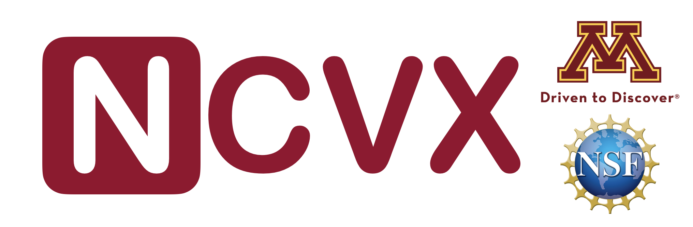

# NCVX

NCVX: A User-Friendly and Scalable Package for Nonconvex Optimization in Machine Learning.

Toward a user-friendly and scalable numerical package for nonsmooth, nonconvex, constrained optimization

Please check https://ncvx.org for detailed instructions (introduction, installation, settings, examples...).

## Brief Introduction

Optimization for nonconvex, nonsmooth, and constrained problems is an essential part of machine learning and deep learning, which is hard to reliably solve without optimization expertise, and also outpace what existing convex optimization software packages can handle. GRANSO is the first numerical optimization package that can handle these problems but exist some limitations such as lack of auto-differentiation and GPU acceleration that preclude the potential broad deployment by general users.

NCVX is python numerical package revamped and translated from the original GRANSO package. In order to lower the barriers to general users and solve modern machine/deep learning problem, we introduced several main features including auto-differentiation, GPU acceleration, tensor input, scalable QP solver and improved core algorithms. NCVX is available at the GitHub repository https://github.com/sun-umn/NCVX under the MIT license, along with a documentation website https://ncvx.org. 

## Update Logs

v1.1.1-alpha: Rename the package from “PyGRANSO” to “NCVX”

v1.1.0-alpha: Cleaned code, added L-BFGS, updated tutorials and documentation.

v1.0.2-alpha: Update installation guide for Linux and windows users

v1.0.1-alpha: Update contirbutions, limitations and acknowledgement sections in docs.

v1.0.0-alpha: Initial release of PyGRANSO. Main features: Python translation, autodifferentiation, GPU-support with PyTorch, matrix/tensor inputs, more powerful solver and several new settings to avoid numerical issues in deep learning problem.

## Acknowledgements

Buyun Liang was supported by the UMII Seed Grant Program (https://research.umn.edu/units/umii).

## Contact
Codes written by Buyun Liang (https://buyunliang.org). Questions or bug reports please send email to Buyun Liang, liang664@umn.edu.

Thanks to bug reporters: 
