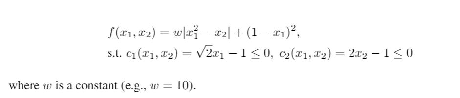

Rosenbrock objective function
========

Modified based on GRANSO's example.

2-variable nonsmooth Rosenbrock objective function, subject to simple bound constraints

Reference: Curtis, Frank E., Tim Mitchell, and Michael L. Overton. "A BFGS-SQP method for nonsmooth, nonconvex, constrained optimization and its evaluation using relative minimization profiles." Optimization Methods and Software 32.1 (2017): 148-181.

runExample.py
-----------------

The arguments for ``pygranso()`` is ``var_dim_map`` (if specify it, please leave nn_model as default None), ``nn_model`` (only used in deep learning problem. If specify it, please leave var_dim_map as default None), ``torch_device`` (optional, default torch.device('cpu')), ``user_data`` (optional) and ``user_opts`` (optional).

1. ``var_dim_map``

   ``var_in`` is a python dictionary used for indicate variable name and corresponding matrix dimension. 
   Since ``x1`` and ``x2`` are two scalars here, we set both of their dimensions to ``(1,1)``::

      var_in = {"x1": (1,1), "x2": (1,1)}

2. ``torch_device``
   
   In the example, we will use cpu. (recommend cpu for small scale problem)::

      device = torch.device('cpu')

3. ``user_data``

   user_data is not used in this problem.

4. ``user_opts``

   User-provided options. First initialize a structure for options::

      from pygransoStruct import Options
      opts = Options()

   Then define the options::

      opts.QPsolver = 'osqp'
      opts.maxit = 1000
      opts.print_level = 1
      opts.print_frequency = 1
      opts.x0 = torch.ones((2,1), device=device, dtype=torch.double)

   See :ref:`settings<settings>` for more information.

Call the main function::

   soln = pygranso(var_dim_map = var_in, torch_device = device, user_data = data_in, user_opts = opts)

combinedFunction.py
-----------------

In ``combinedFunction.py`` , ``combinedFunction(X_struct, data_in = None)`` is used to generate user defined objection function ``f``, 
inequality constraint function ``ci`` and equality constraint function ``ce``.

Notice that we have auto-differentiation feature implemented, so the analytical gradients are not needed.

1. Obtain the (pytorch) tensor form variables from structure ``X_struct``. And require gradient for the autodiff::

        x1 = X_struct.x1
        x2 = X_struct.x2
        x1.requires_grad_(True)
        x2.requires_grad_(True)

2. Obtain data from ``runExample.py``: skip

3. Define objective function. Notice that we must use pytorch function::

    # [0,0] means obtain scalar from the torch tensor
    f = (8 * abs(x1**2 - x2) + (1 - x1)**2)[0,0]

4. Define the inequality constraint function. We must initialize ``ci`` as a struct, 
   then assign different constraints as ``ci.c1``, ``ci.c2``, ``ci.c3``...::

      ci = general_struct()
      ci.c1 = (2**0.5)*x1-1  
      ci.c2 = 2*x2-1 

5. Since no inequality constraint required in this problem, we set ``ce`` to ``None``::

      ce = None

6. Return user-defined results::

     return [f,ci,ce]

``eval_obj(X_struct,data_in = None)`` is similar to ``combinedFunction()`` described above. The only difference is that this function is only used to generate objective value. 
