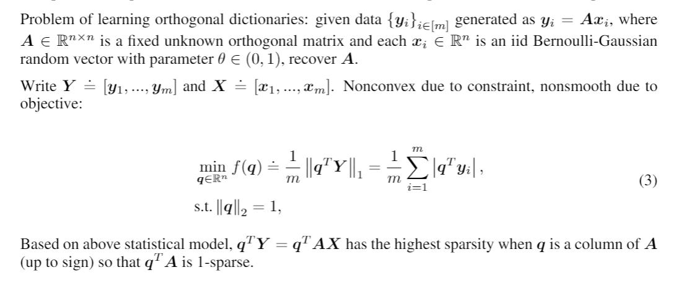

Dictionary Learning
========

This example is based on Bai, Yu, Qijia Jiang, and Ju Sun. "Subgradient descent learns orthogonal dictionaries." arXiv preprint arXiv:1810.10702 (2018).

runExample.py
-----------------

The arguments for ``pygranso()`` is ``var_dim_map`` (if specify it, please leave nn_model as default None), ``nn_model`` (only used in deep learning problem. If specify it, please leave var_dim_map as default None), ``torch_device`` (optional, default torch.device('cpu')), ``user_data`` (optional) and ``user_opts`` (optional).

1. ``var_dim_map``
   
   In the example, we set dimension::

      n = 30
   
   ``var_in`` is a python dictionary used for indicate variable name and corresponding matrix dimension. 
   Since ``q`` is a vector here, we set the dimension to ``(n,1)``::

      var_in = {"q": (n,1)}

2. ``torch_device``
   
   In the example, we will use cuda. (If cuda is not available, please use cpu instead)::

      device = torch.device('cuda')
   

3. ``user_data``

   To save the computational sources, we recommend to generate all the required data in the ``runExample.py``.

   .. warning::
      All non-scalar parameters should be in Pytorch tensor form
   
   First initialize a structure for parameters::

      from pygransoStruct import Data
      data_in = Data()

   Then define the parameters::

      m = 10*n**2   # sample complexity
      theta = 0.3   # sparsity level
      Y = norm.ppf(np.random.rand(n,m)) * (norm.ppf(np.random.rand(n,m)) <= theta)  # Bernoulli-Gaussian model
      parameters.Y = torch.from_numpy(Y) 
      parameters.m = m

4. ``user_opts``

   User-provided options. First initialize a structure for options::

      from pygransoStruct import Options
      opts = Options()

   Then define the options::

      opts.QPsolver = 'osqp' 
      opts.maxit = 500
      x0 = norm.ppf(np.random.rand(n,1))
      x0 /= la.norm(x0,2)
      x0 = torch.from_numpy(x0).to(device=device, dtype=torch.double)
      opts.x0 = x0
      opts.opt_tol = 1e-6
      opts.fvalquit = 1e-6
      opts.print_level = 1
      opts.print_frequency = 10
      opts.print_ascii = True

   See :ref:`settings<settings>` for more information.

Call the main function::

   soln = pygranso(var_dim_map = var_in, torch_device = device, user_data = data_in, user_opts = opts)

combinedFunction.py
-----------------

In ``combinedFunction.py`` , ``combinedFunction(X_struct, data_in = None)`` is used to generate user defined objection function ``f``, 
inequality constraint function ``ci`` and equality constraint function ``ce``.

Notice that we have auto-differentiation feature implemented, so the analytical gradients are not needed.

1. Obtain the (pytorch) tensor form variables from structure ``X_struct``. And require gradient for the autodiff::

      q = X_struct.q
      q.requires_grad_(True)

2. Obtain data from ``runExample.py``::

       m = data_in.m
       Y = data_in.Y

3. Define objective function. Notice that we must use pytorch function::

      qtY = q.t() @ Y
      f = 1/m * torch.norm(qtY, p = 1)

4. Since no inequality constraint required in this problem, we set ``ci`` to ``None``::

      ci = None   

5. Define the equality constraint function. We must initialize ``ce`` as a struct, 
   then assign different constraints as ``ce.c1``, ``ce.c2``, ``ce.c3``...::

      from pygransoStruct import general_struct
      ce = general_struct()
      ce.c1 = q.t() @ q - 1

6. Return user-defined results::

     return [f,ci,ce]

``eval_obj(X_struct,data_in = None)`` is similar to ``combinedFunction()`` described above. The only difference is that this function is only used to generate objective value. 